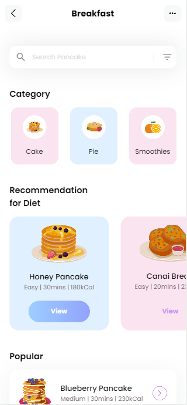
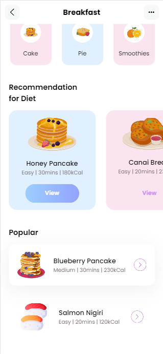

# Descrição

Este é meu primeiro app em Flutter, um design de página para um app de receitas. A página apresenta as seguintes seções:

- Categoria: Uma lista de categorias de receitas, como Cake, Pie, Smoothies, etc.
- Dieta recomendada: Uma lista de receitas recomendadas, elas apresentam dificuldade, tempo de preparo e calorias,
  dieta cetogênica, etc.
- Popular: Uma lista das receitas mais populares do app.

### Screenshots

Referências

- Flutter Documentation: https://flutter.dev/docs/
- Material Design Guidelines: https://material.io/design/
- Este projeto foi criado seguindo os passos do
  [video](https://www.youtube.com/watch?v=D4nhaszNW4o&t=317s&ab_channel=FlutterGuys) do
  canal [Flutter Guys](https://www.youtube.com/@flutterguys).